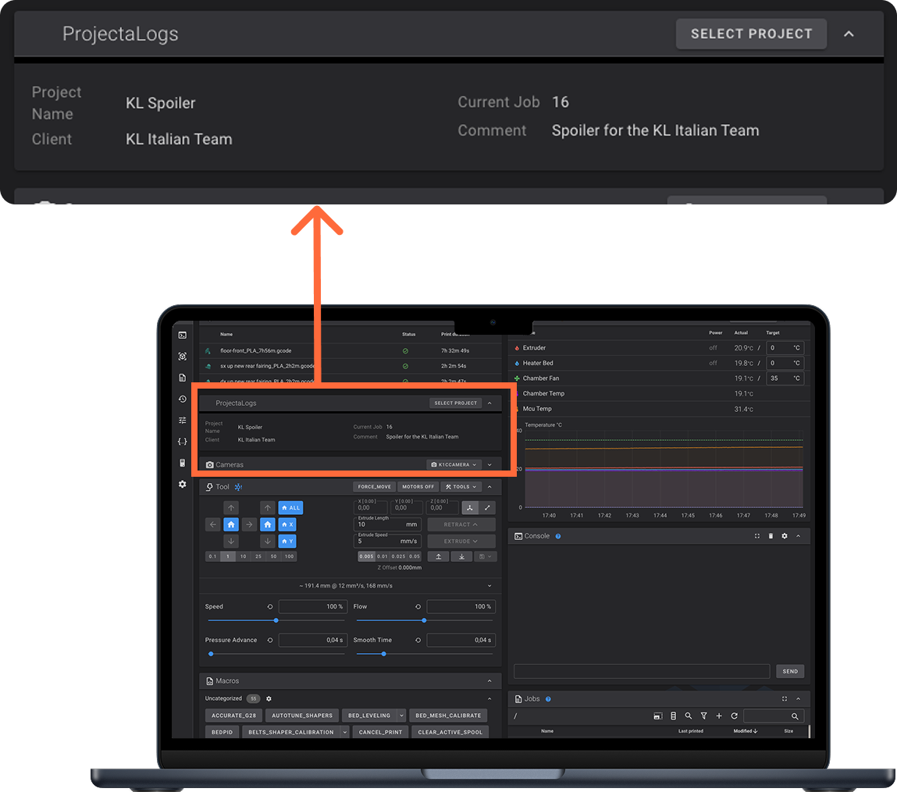
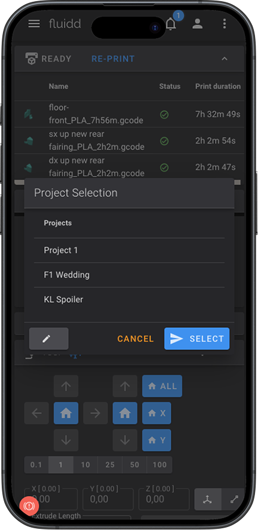
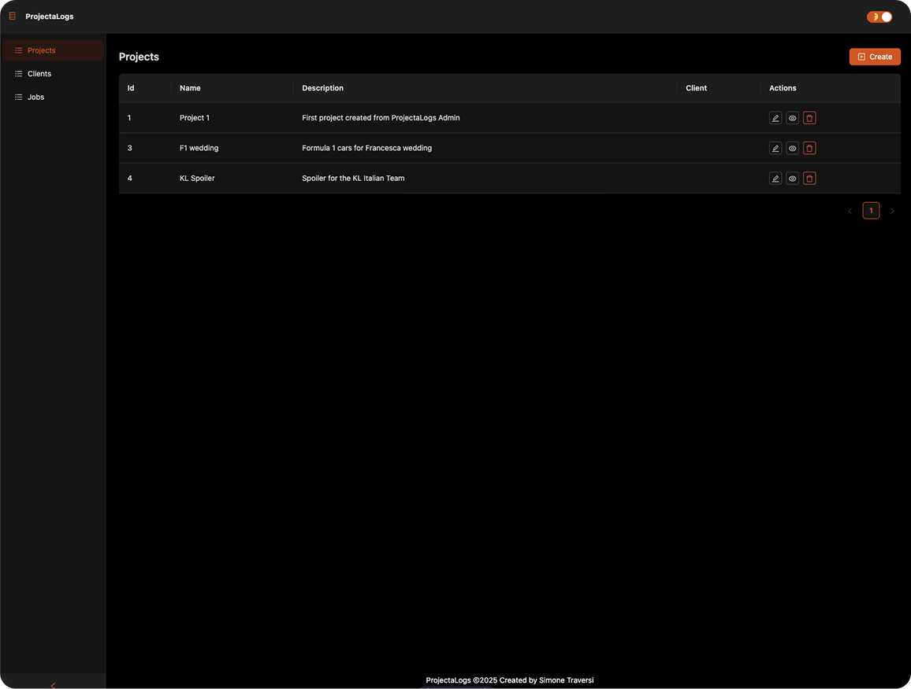

# ProjectaLogs
*A Work in Progress platform for managing 3D printing projects*

[]() []() []() []()

>[!IMPORTANT]
> This repository is under active development. The Moonraker component is **not yet usable** and, for now, must be installed **directly on the printer**.

---

## 📖 Overview

**ProjectaLogs** is a full-stack platform that brings **project & client management** into your 3D printing workflow.

|  |  |  |
| :-------------------------: | :-------------------------------: | :-------------------------------: |

- **Moonraker Component** (`projectalogs.py`)  
  Associates print jobs with Projects/Clients and reports results back to the server.  
  *Experimental: manual install on the printer required.*

- **Backend (NestJS)**  
  REST API for managing projects, clients, jobs and printers.  
  Ships with SQLite by default (easier local setup).

- **Frontend (React + Refine)**  
  A web dashboard to create/browse Projects, attach Jobs, view history, and manage Printers.

## 🧭 Table of Contents

- [ProjectaLogs](#projectalogs)
  - [📖 Overview](#-overview)
  - [🧭 Table of Contents](#-table-of-contents)
  - [🏗️ Architecture](#️-architecture)
  - [🚀 Getting Started](#-getting-started)
    - [Requirements](#requirements)
    - [Quick Start (Docker Compose)](#quick-start-docker-compose)
  - [🛠️ Development](#️-development)
    - [Install dependencies](#install-dependencies)
    - [Start Backend (NestJS, API on :3000)](#start-backend-nestjs-api-on-3000)
    - [Start Frontend (React + Refine, dev on :5173)](#start-frontend-react--refine-dev-on-5173)
    - [Tmux convenience script](#tmux-convenience-script)
  - [🧩 Moonraker Component (Experimental)](#-moonraker-component-experimental)
  - [🗺️ Roadmap](#️-roadmap)
  - [🤝 Contributing](#-contributing)
  - [📜 License](#-license)
  - [🙌 Credits](#-credits)

---

## 🏗️ Architecture

High-level flow:

```

    Printer (Fluidd interface) → Moonraker → (projectalogs.py) → ProjectaLogs Backend (NestJS) → SQLite
                                                                      ↓
                                                                 ProjectaLogs Frontend (React + Refine)
```

Key URLs (defaults):

- Backend API: http://localhost:3000/api
- Frontend (dev): http://localhost:5173  
- Frontend (prod build served by backend or container): http://localhost:3000

---

## 🚀 Getting Started

### Requirements

- Docker (recommended for first run)
- Node.js (for local development)
- A Klipper + Moonraker setup (only if you want to test the component)

### Quick Start (Docker Compose)

1. Create a directory:
```
    mkdir projectalogs
    cd projectalogs
    mkdir compose
    cd compose
```

2. Create a `docker-compose.yml` file in /projectalogs/compose:
```
    nano docker-compose.yml
```

```
  services:
    projectalogs:
      image: docker.io/simotra/projectalogs:latest
      restart: unless-stopped
      volumes:
        - "./data:/app/data"
      ports:
        - "4499:3000"
```


3. Start the service:
```
    docker-compose up -d
```

4. Open the frontend in your browser:

    http://localhost:4499

> Notes:
> - Data is persisted in the `./data` folder.
> - In this setup, the frontend is served by the backend container on port `4499`.
> - To stop the service, run `docker-compose down`.

---

## 🛠️ Development

### Install dependencies

    npm install
    cd dashboard
    npm install
    cd ..

### Start Backend (NestJS, API on :3000)

    npm run start:dev

API base path:

    http://localhost:3000/api

### Start Frontend (React + Refine, dev on :5173)

    cd dashboard
    npm run dev

Frontend dev URL:

    http://localhost:5173

### Tmux convenience script

    ./start_all.sh
>[!NOTE]
> Optional helper to spin up services (adjust as needed).

---

## 🧩 Moonraker Component (Experimental)

Status: **NOT READY FOR PRODUCTION**. API and behavior may change.

- File: `projectalogs.py`
- Temporary install: copy to your Moonraker components directory on the printer.
- Config: merge the snippet from `moonraker.conf.example` into your Moonraker configuration.

Expected behavior (target):

- Attach the current print job to a selected Project/Client.
- On job end (success/failure), POST a summary to the ProjectaLogs backend.
- Allow project selection from Fluidd/Mainsail (via a small dialog).


---

## 🗺️ Roadmap

- [ ] Finalize Moonraker hooks (start/end job, error handling).
- [ ] Frontend polish (search, filters, analytics).
- [ ] Export/Import data.
- [ ] CI/CD and container hardening.

---

## 🤝 Contributing

- Fork the repo and create a feature branch.
- Add/adjust tests where relevant.
- Submit a clear, focused PR describing your changes.

---

## 📜 License

This project is licensed under the [MIT License](LICENSE).

---

## 🙌 Credits

Inspired by [Spoolman](https://github.com/xynerator/spoolman) and the idea of integrating project tracking into Moonraker-driven workflows and dashboards (Fluidd/Mainsail), with a modern stack (NestJS + React/Refine).
